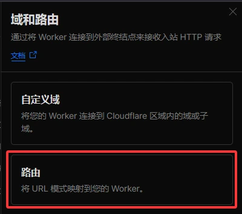
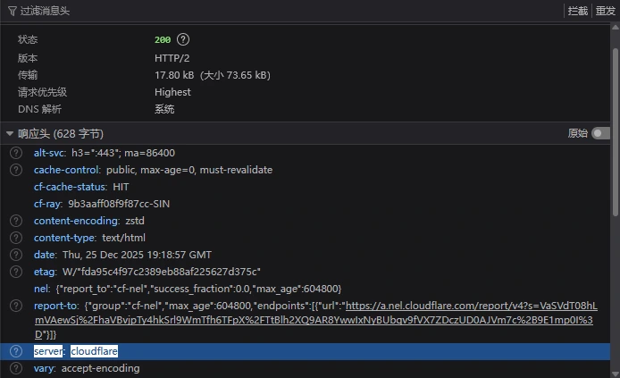

cover: `pixiv@mmAir:132178898`

# 静态Worker与优选

> Cloudflare是减速云？孩子们，这是刻板印象。

为静态站点做“优选”，是很多追求访问速度的站长都会考虑的方案。
不过，如果你用的是 Cloudflare Pages，可能会遇到一个有点麻烦的限制：它要求域名必须解析到指定的 CNAME 记录，否则就会喜提 `Error 1000 DNS points to prohibited IP` (还行吧，比隔壁某E**One返回418好)

那么，有没有其他 Cloudflare 服务能绕过这个限制呢？有的，兄弟，有的。它就是 **Cloudflare Worker**。

Worker 支持 **“将 URL 模式映射到您的 Worker”**，官网是这么说的。不太好理解？是这样：只要请求经过 Cloudflare 的网络，并且请求的 `Host` 匹配了你设置的路由规则，Worker 就会进行响应。这功能挺好是不，优选非常方便。

**核心优势对比：**
| 特性 | Cloudflare Pages | Cloudflare Worker (静态) |
| :--- | :--- | :--- |
| **域名解析限制** | 必须解析到指定 CNAME | 可解析到任意 Cloudflare IP/CNAME |
| **优选兼容性** | 不好搞 | **完美支持** |
| **免费额度** | 无限请求 | **静态资源请求不计费** |
| **配置灵活性** | 相对固定 | 可通过路由规则精细控制 |

更妙的是，Worker 托管静态资源的请求**不计入每日 10 万次的免费限额**，完全免费。对于一个纯静态站点，只要正确配置，就完全不用担心用量问题。

想试试看的话，继续往下看吧。

## 创建一个静态Worker

首先，在 Cloudflare Dashboard 创建一个新的 Worker，挺简单的所以这里略过。

不过呢，不使用 Wrangler CLI 且未预先配置，在部署时很可能会遇到如下错误：
```
✘ [ERROR] Missing entry-point to Worker script or to assets directory
If there is code to deploy, you can either:
  - Specify an entry-point to your Worker script via the command line (ex: `npx wrangler deploy src/index.ts`)
  - Or create a "wrangler.jsonc" file containing:
```
简单来说，我们缺少必要配置，wrangler不知道该怎么做。错误报告给出了两个方案：
1.  创建一个动态 Worker 入口点（例如 `index.js`）
2.  创建一个配置文件 `wrangler.jsonc`（或 `wrangler.toml`）

显然，我们的目标是创建静态Worker，所以不能选第一个方案。挺好解决，补个配置`wrangler.toml`就行：
```toml title="wrangler.toml"
name = "worker名字"
compatibility_date = "2025-12-11"

[assets]
directory = "./dist" # 这里填写你的构建产物目录；它的作用是让Worker处理静态资产
```

提交后，绑定 Git 仓库的 Worker 会自动部署。成功日志类似于：
```
✨ Success! Uploaded 5 files (197 already uploaded) (1.38 sec)
Total Upload: 0.33 KiB / gzip: 0.24 KiB
Uploaded 名字 (5.28 sec)
Deployed 名字 triggers (0.78 sec)
  https://你的域名.workers.dev
Current Version ID: 81185480-40cd-xxxx-xxxx-8723607xxxxx
```
Wrangler采用差异上传策略，只会上传被更改的构建内容，可以大大提升(存疑)部署速度。

### 自定义 404 页面（可选）

Cloudflare worker 的默认404行为是只返回`404 HTTP CODE`，这意味着默认情况下自定义404页面无法生效。

如果你需要自定义404页面，则需要让构建产物包含`404.html`，并添加字符串`404-page`到wrangler配置的`assets.not_found_handling`。看起来大概像这样：
```toml title="wrangler.toml"
[assets]
directory = "./dist" # 这里填写你的构建产物目录
not_found_handling = "404-page"
```
设置后，访问不存在的路径将返回该页面内容，同时状态码为 `404`。

## 进行优选

:::important
**域名必须托管在 Cloudflare** 才能添加 Worker 路由。这是使用此方案的前提。
:::
静态 Worker 部署好后，最关键的一步是配置路由，从而实现优选。
1.  进入 Worker **设置**，找到 **“域和路由”**，点击 **“添加路由”**

2.  按以下示例填写表单：
  - **区域**：选择你已托管在 Cloudflare 的域名
  - **路由**：填写 `你的域名/*`（例如 `blog.example.com/*`）
  - **失败模式**：按照你的需求选择

3.  点击 **“添加路由”** 保存
4. 为你的目标域进行解析，只要最终指向任一Cloudflare的IP地址或官方CNAME即可，想怎么解析都可以，甚至可以通过不同运营商解析不同节点来获得最佳体验。


### 验证是否生效
等待 DNS 生效后（通常几分钟），访问你的域名。打开Devtools，查看网络请求的响应头。如果看到 `server: cloudflare` 等标志，即表示流量已通过 Cloudflare 网络并由你的 Worker 处理：


就是这样，配置完了。如果你也在 Pages 的解析限制上碰过壁，或者单纯想找个更随意的托管法子，这套方案值得一试。有啥问题，欢迎在下面聊。
