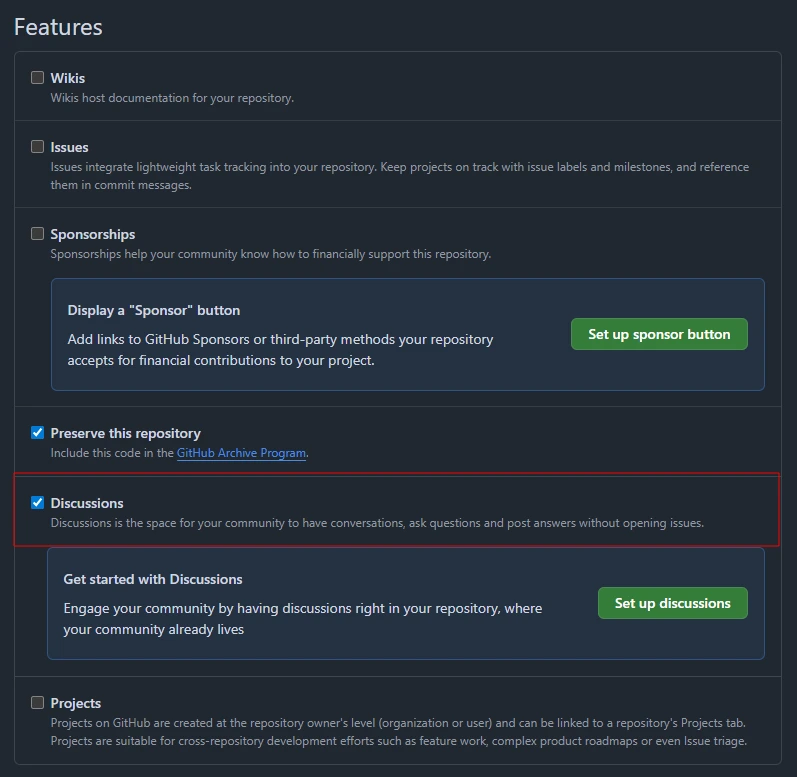
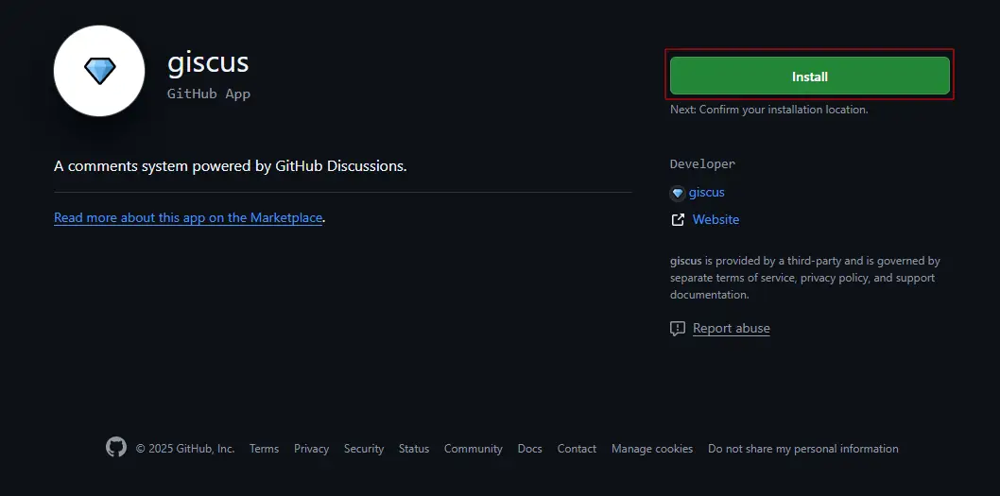
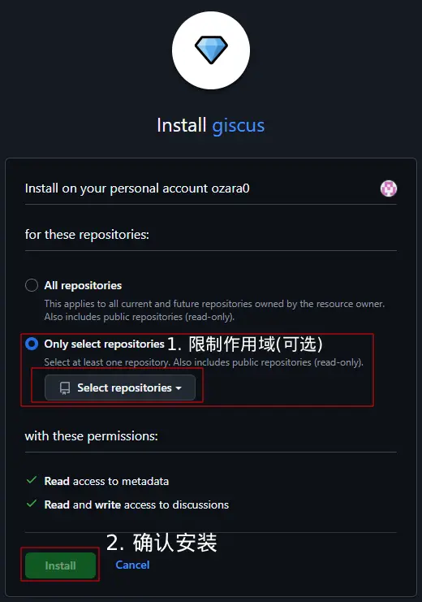

cover: `pixiv@シカ:135300143`

> 静态博客什么都好，就是少了点"人气"？让 Giscus 帮你打破沉默，与读者互动！

::github{repo="giscus/giscus"}

它基于 GitHub Discussions，让你可以免费、免托管地为静态博客添加评论功能。而且，由于依托 GitHub，评论支持 Markdown 语法，回复、引用等功能一应俱全。
:spoiler[有点门槛也可以防止一些众所周知的问题...比如滥用！]

# 配置Giscus
感兴趣了吗？那就开始配置吧！

## 启用仓库Discussions
首先，我们需要一个**公开的 GitHub 仓库**，用于存放评论数据。

1. 进入仓库 **Settings**（在header栏）
2. 找到 **Features** 部分（往下滚动就可以看到）
3. 勾选 **Discussions** 复选框



## 安装Giscus app到Github
现在我们需要授权 Giscus 访问你的仓库：

1. 访问 <a href="https://github.com/apps/giscus" target="_blank" rel="noopener noreferrer">Giscus App 安装页面</a>
2. 点击绿色的 **Install** 按钮

3. （可选但非常建议）点击`Only select repositories`，然后再点击下面的`Select repositories`，选择要授权的仓库


## 通过giscus.app获取配置文件，并添加到网站
访问 <a href="https://giscus.app/zh-CN" target="_blank" rel="noopener noreferrer">giscus.app</a> ，像填问卷一样配置：

- **仓库**：选择你刚配置的仓库
- **页面映射**：推荐 `pathname`（按文章路径）
- **特性**：按需开启反应、元数据等
- 其他：按需选择

它会自动生成包含所填写配置的Script标签，填写完成后就可以在比较靠近底部的地方看到给出的可用代码了，你可以直接复制到你的网站中。

:::caution
请不要复制本站的示例，因为其并非真实的配置信息。如果你用了，恭喜你，报错啦嘿嘿
:::
生成结果示例：
```js {2-5}
<script src="https://giscus.app/client.js"
  data-repo="user/repo"
  data-repo-id="R_kgxxxx84Ig"
  data-category="Announcements"
  data-category-id="DIC_kwDxxxxsxxxxx"
  data-mapping="pathname"
  data-strict="0"
  data-reactions-enabled="1"
  data-emit-metadata="0"
  data-input-position="bottom"
  data-theme="preferred_color_scheme"
  data-lang="zh-CN"
  crossorigin="anonymous"
  async>
</script>
```

## Giscus配置文件
:::warning
**默认情况下，任何网站都能使用你的 Giscus 配置！**<br/>
想象一下：有人复刻了你的博客代码但忘记修改配置，结果所有访客的评论都提交到了**你的仓库**——孩子们，这并不好笑。<br/>
:::
如何解决这个问题呢？我们只需要在你在第一步配置的**discussions仓库**中创建如下文件:
```json title="giscus.json"
{
    "origins": ["https://example.com"],
    "originsRegex": ["http://localhost:[0-9]+"],
    "defaultCommentOrder": "oldest"
}
```
它是一个Giscus的配置文件，需要放在仓库的根目录下。其中：
- `origins`：允许访问的域名列表
- `originsRegex`：允许访问的域名正则表达式列表
- `defaultCommentOrder`：默认评论排序方式，支持 `oldest` 和 `newest`

Giscus 的配置就是这么简单，本章完。遇到问题尽管在下方评论哦！
