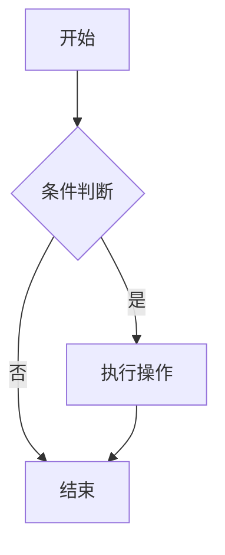
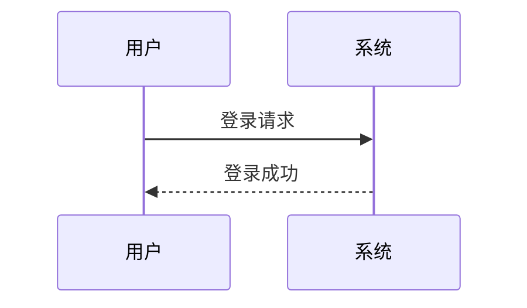
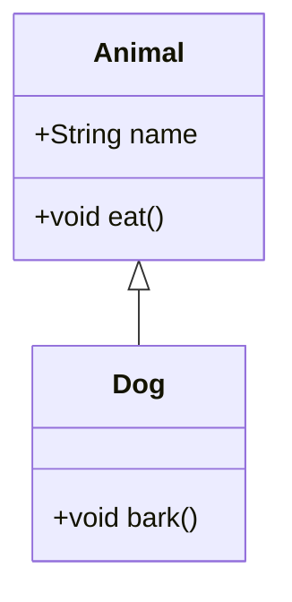
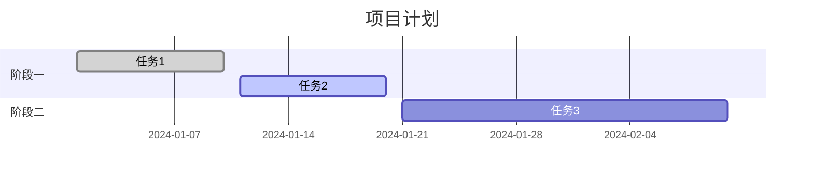

# Markdown 功能测试文档

本文档聚合了多种 Markdown 扩展语法与功能示例，用于测试和演示。

---

## 一、基础 Markdown 示例

### 标题与段落

# 一级标题

段落之间用空行分隔。

第二段。*斜体*、**粗体**和`等宽字体`。列表如下：

- 第一项
- 第二项
- 第三项

> 引用块可以这样写。
>
> 可以跨越多段。

### 列表与代码

1. 有序列表项
2. 第二项
3. 第三项

```python
import time
for i in range(10):
    time.sleep(0.5)
    print(i)
```

### 表格

| 尺寸 | 材质     | 颜色   |
|------|----------|--------|
| 9    | 皮革     | 棕色   |
| 10   | 麻布     | 自然色 |
| 11   | 玻璃     | 透明   |

### 数学公式

行内公式：$\omega = d\phi / dt$

块级公式：

$$
I = \int \rho R^{2} dV
$$

---

## 二、嵌入视频示例

### YouTube

<iframe width="100%" height="468" src="https://www.youtube.com/embed/5gIf0_xpFPI?si=N1WTorLKL0uwLsU_" title="YouTube video player" frameborder="0" allowfullscreen></iframe>

### Bilibili

<iframe width="100%" height="468" src="//player.bilibili.com/player.html?bvid=BV1fK4y1s7Qf&p=1" scrolling="no" border="0" frameborder="no" framespacing="0" allowfullscreen="true"> </iframe>

---

## 三、扩展功能：提示框与卡片

### 提示框（Admonitions）

:::note
这是一条提示信息。
:::

:::tip[自定义标题]
这是一条带自定义标题的提示。
:::

### GitHub 仓库卡片

::github{repo="Yamrc/Hako"}

---

## 四、代码高亮与标记（Expressive Code）

### 基础高亮

```js
console.log('Hello, world!')
```

### 额外标题
```js title="index.js"
console.log("带标题")
````

### 行标记与折叠

```js {1, 3-4} showLineNumbers
function demo() {
  console.log('此行被标记')
  // 这两行被标记为范围
  return true
}
```

```js collapse={2-4}
function longFunction() {
  // 这部分默认折叠
  const a = 1
  const b = 2
  return a + b
}
```

### 终端样式

```bash
echo "这是一个终端示例"
```

---

## 五、Mermaid 图表测试

### 流程图



### 时序图



### 类图



### 甘特图



---

## 六、其他常用元素测试

### 脚注

这是一个带脚注的句子[^1]。

[^1]: 脚注内容在此。

### 隐藏内容（剧透）

答案在这里：:spoiler[这是隐藏的内容，支持 **Markdown** 格式]。

### 图片引用（注释写法，实际不渲染）

[//]: # ()
