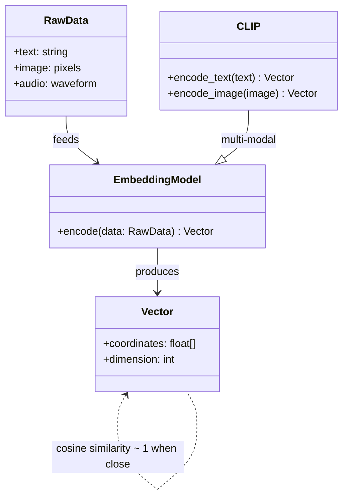
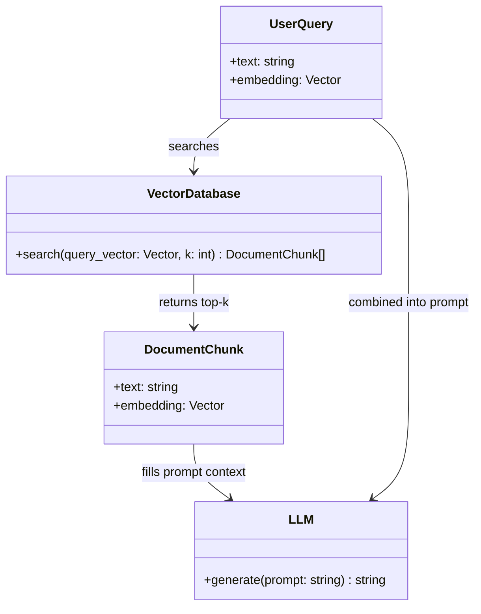

cover: `pixiv@Elop:31781990`

> 想让 Agent 记住聊天上下文，但不可能把所有历史塞进 prompt，否则模型一定会因为上下文过长导致能力退化，严重的会变成阿库娅。这时候就需要根据语义来选择性插入上下文。

# 关于向量化与其在检索领域的运用

最近在写一个AI相关的项目，在处理上下文相关方面时自然而然地注意到了一个词：**RAG**，译名**检索增强生成**。  
RAG这玩意听起来有点高级。它的原理是什么？~~询问Sydney娘~~经过一番搜索后，了解到其通常基于**向量化**与**ANN**实现。

那么向量化与ANN又是什么东东？V我50解锁下文..啊不是，且听我细细道来。

## 向量是什么？

让我们先从水下第一个萌芽的生命开始...扯远了。让我们先从 **向量（vector）** 开始。好吧，这玩意是高中数学会接触到的内容，想必大家都知道是怎么一回事，这里就不多赘述了，不懂的去问Sydney娘。

向量不止能是二维的，它还可以有更多的维度，比如增加一个轴，变成三维向量，再增加一个轴...扯远了。简单理解，就是把一段任何模态的数据（文字、图片、声音等）压缩成一个高维空间里的点，每一维都是一个抽象的“特征标签”。  
理论上维数越高，能表达的信息越细腻，匹配越精确。但也不是越高越好——维数一高，计算量和显存一起螺旋升天，或者耗时随着BVVD的马一同爆炸。市面上常见的文本 Embedding 模型吐出来的通常是 **768 维** 或 **1536 维**，算余弦相似度极快，属于甜点区间。

听不懂？想象世界上所有东西都被偷偷贴了一组看不见的坐标：  
“猫” 是 (0.8, 0.2, -0.5, …)，  
“猫娘” 是 (0.7, 0.3, -0.4, …)，  
而“菜月昴”，在另一个方向一千维之外的《从零开始的异世界》分区里反复去世（I昴TV这一块）。  
这个把东西变坐标的过程，就叫 **Embedding（嵌入）**。

能办到这种黑魔法，当然是靠各种大模型（BERT、CLIP）在那儿吭哧吭哧地算。更妙的是，**不同模态的数据也可以共用同一个空间**。比如 CLIP 能把十香的图片和文字 “Yatogami Tohka” 映射到几乎挨着的坐标，图文互相秒搜就是这么来的。

:::note
别问我为什么这里有个神人类图，排版需要嘛（（（
:::

## 从零开始的检索任务：KNN 暴击

好，那么好，好，我们已经学会把万物变成向量了 ~~（脑内模拟的那种）~~ ，接下来就该考虑如何进行检索了。
> 给定一个查询向量 q，在一个百万、亿、甚至万亿级的向量库 {v₁, v₂, …, vₙ} 里，找到与 q 最相似的前 K 个向量。
这就是经典的 **K-最近邻(KNN)**。相似度一般用余弦相似度（只关心方向，不关心向量有多长）或者内积，本质就是找坐标系里离你最近的那几个点。

那么问题来了：如果老老实实逐个计算距离，那叫**暴力计算**，暴力计算通常用于精准度要求极高的场景，比如公安局人脸搜索啥的。数据几百条时毫无压力；但一旦上了亿，你让老黄拿命去遍历也顶不住。而且遍历次数还要乘上你的目标向量数(K)，这就更蛋疼了。

## 我要当秒男：ANN是什么

答案是不用算得那么准——**用近似换速度**。这也就是所谓的 **ANN（Approximate Nearest Neighbors，近似最近邻）**。

打个比方：你想在巨型图书馆里找一本和手里这本内容最像的书。  
- 暴力检索 = 把每本书抽出来逐页比对，绝对精准，但等待时间够猴哥从石头里出来再到五指山下。  
- ANN = 先根据大致分类编号、封面颜色、开本大小快速定位到附近几个书架，再在那里小范围精确比对。牺牲了一点点“绝对最像”，换来了能接受的速度。

### 常见 ANN 实现流派一览

目前业内的常见做法是：
- **HNSW（Hierarchical NSW，NSW是Navigable Small World，可导航小世界网络）**  
    听说过六度分隔理论吗？对，就是每个人只需认识几个朋友，就能在几次转介绍后联系到地球上的任何人的理论。  
    也就是说，世界上任何事物都可以通过间接的途径建立起连接。至于NSW算法，我们暂时不展开说。
- **IVF（倒排文件索引）+ PQ（乘积量化）**  
    先对所有向量做聚类，分成几千个“小本本”（倒排列表）；查询时只选离 q 最近的几个类去搜。PQ 则把高维向量切成几段分别压缩，用手机挂传奇压缩包的思路降低计算和内存开销。两者合体就是 FB 开源 FAISS 里的常用套路。
- **LSH（局部敏感哈希）**  
    俗话说臭味相投。用哈希函数确保“挨得近的向量更容易被分到同一个桶”。查询时直接去对应桶里翻，简单粗暴，但是有效。适合对精度容忍度较高的场景。

所以，ANN 的核心思想就一句话：**快就是好，精确射手算个屁**。而且现在参数调得好，精度经常只差零点几个百分点，体感完全无差别。

## 让我们做封装：向量数据库

你当然可以自己手写一份 FAISS 索引然后存成 pickle。但在生产环境里你更需要：向量增删改查、持久化、分布式、元数据过滤、混合搜索（向量 + 关键词）......

于是就有了各种**向量数据库**专门帮你打理这些脏活累活。Milvus、Pinecone、Weaviate、Chroma、Qdrant、LanceDB 等等，活像当年 NoSQL 大爆发时的场面。  
它们内部基本都集成了前面说的 HNSW 或 IVF-PQ，对外就给你一行 SDK 调用，几行代码建完索引，然后秒搜，十分甚至九分的方便啊（赞赏）

这也是你项目里 RAG 得以实现的底座：  
1. 把所有文档分块，丢进 Embedding 模型生成向量，存入向量数据库。
2. 用户问一个问题，同样生成向量，发给数据库索要 Top K 相关片段。
3. 把搜出来的片段塞进 Prompt，喂给 LLM 生成最终答案。
整个过程一般几十毫秒，这样就可以找到关联性较高的上下文丢给AI，不用完整传，省钱的同时可以避免上下文太长。

## 除了 RAG，这玩意还能干嘛？

向量检索的泛用性简直离谱，因为它的本质就是“把什么鬼都变成点，然后找邻居”。顺手举几个你肯定见过的：

- **语义搜索**：搜“怎么让电脑更快”，能把“提升系统性能的方法”也找出来，再也不用靠关键词撞大运；  
- **以图搜图 / 以文搜图**：电商上传衣服照片找到同款，或者对手机说“白底黑猫头像”搜出一堆表情包；  
- **推荐系统**：把用户和物品都 Embedding 一下，KNN 一搜就是“看了又看”和“买过还买”；  
- **代码搜索**：AI AGENT直接匹配已编目的代码，不需要跑rg命令浪费上下文和你的token；  
- **分子结构搜索、音频指纹、视频去重**......只有你想不到，没有向量不能嵌的。

## 收个尾

说句废话，向量搜索就是把各种模态的信息搞成同一种坐标，然后找最近的信息，越近相关性越高。
剩下的无论 RAG、搜图还是推荐，都是在这套骨架外面套一层皮。

至于你问我如何自己捣鼓一个 Demo——有生之年吧，我先写我自己的项目了。

（完）
